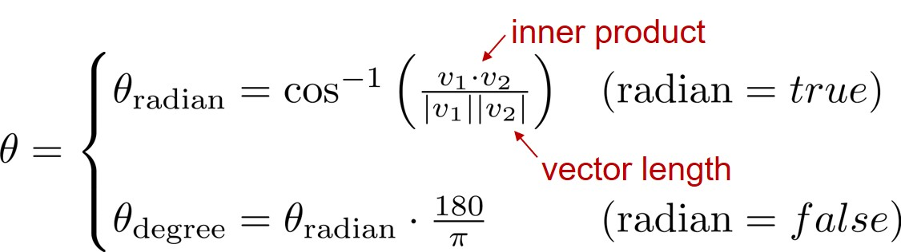
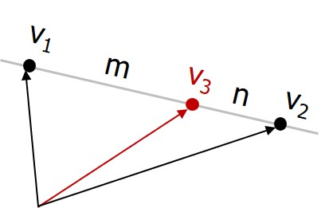
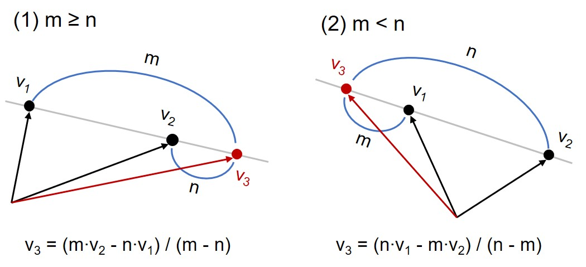

# Assignment #02


- In this assignment, we aim to implement some functionalities for vectors in 3-dimensional(3D) space.

- The submission deadline is <span style="color:red">**October 14, 2024 at 23:59**</span>. 

- All declarations such as function prototypes, structures, etc should be written in **"vector3d.h"** header file, and function definitions (i.e., function bodies) should be written in **"vector3d.cpp"** source file.

- In the evaluation system, the file names, "vector3d.h" and "vector3d.cpp", are used, thus your submission will <span style="color:red">**NOT**</span> be recognized by the system <span style="color:red">**if you change the file names**</span>.

- Submit the two files, "vector3d.h" and "vector3d.cpp", to the BDC system. <span style="color:red">**DO NOT**</span> include a file that contains **main** function.

- You **CANNOT** use the C++ standard library unless the headers are explicitly specified. You can include `<cmath>` header in "vector3d.cpp" to use `sqrt`, `pow`, `fabs`, `acos`, and etc.

- Collaborate with your colleagues to write and share test cases in `main` function. <span style="color:red">**However, any plagiarism is not allowed.**</span> Plagiarism will be checked by automatic methods in the system.


- Your files and codes might look like:


    ```C++
    // vector3d.h
    #pragma once

    double vector3d_len(Vector3d v);
    Vector3d vector3d_add(Vector3d v1, double c);

    // omitted...
    ```

    ```C++
    // vector3d.cpp
    #include "vector3d.h"

    double vector3d_len(Vector3d v)
    {
        // Implement the function...
    }

    Vector3d vector3d_add(Vector3d v1, double c)
    {
    // Implement the function...
    }
    
    // omitted...
    ```

    ```C++
    // DO NOT submit a source file that includes main() function.
    // Use main() function only for your tests.
    #include "vector3d.h"

    int main()
    {
        // Write some test cases for verifying your codes...

        return 0;
    }
    ```


## Problem (1)

Write a structure and functions for vectors in 3D space.
The operations between a vector and a constant should be implemented as element-wise operations.

#### (a) Define `Vector3d` structure in "vector3d.h" as follows.
```C++
struct Vector3d
{
    double x;  // X-axis
    double y;  // Y-axis
    double z;  // Z-axis
};
```

The vectors in 3D space can be represented as follows.

$$
\begin{align*}
& v := (x, \ y, \ z), \\
& v_1 := (x_1, \ y_1, \ z_1), \\
& v_2 := (x_2, \ y_2, \ z_2).
\end{align*}
$$

    
#### (b) Write `vector3d_len` function for `Vector3d` structure. [5pts]
```C++
double vector3d_len(Vector3d v);
```

The length of a vector is defined by the following equation:

$$
| v | := \sqrt{x^2 + y^2 + z^2}
$$

These are some examples of how to calculate the length of a vector.

$$
\begin{align*}
v = (3.0, 0.0, 4.0) \ &\rightarrow \  | v | = 5.0 \\
v = (1.0, 2.0, 3.0) \ &\rightarrow \  | v | = 3.7416573
\end{align*}
$$


#### (c) Write `vector3d_add` function for `Vector3d` structure. [5pts]
```C++
Vector3d vector3d_add(Vector3d v, double c);
```

The addition of a vector and a constant is defined by the following equation:

$$
v + c := (x + c, \ y + c, \ z + c)
$$

These are some examples of how to calculate the addition.

$$
\begin{align*}
& v = (1.0, 2.0, 3.0), \ c = 5.0  \ \rightarrow \ v + c = (6.0, 7.0, 8.0)\\
& v = (2.0, 4.0, 6.0), \ c = -1  \ \rightarrow \ v + c = (1.0, 3.0, 5.0)\\
\end{align*}
$$


#### (d) Write `vector3d_sub` function for `Vector3d` structure. [5pts]
```C++
Vector3d vector3d_sub(Vector3d v, double c);
```

Subtracting a constant from a vector is defined by the following equation:

$$
v - c := (x - c, \ y - c, \ z - c)
$$

These are some examples of how to calculate the subtraction.

$$
\begin{align*}
& v = (1.0, 2.0, 3.0), \ c = 5.0  \ \rightarrow \ v - c = (-4.0, -3.0, -2.0)\\
& v = (2.0, 4.0, 6.0), \ c = -1  \ \rightarrow \ v - c = (3.0, 5.0, 7.0)\\
\end{align*}
$$


#### (e) Write `vector3d_sub` function for `Vector3d` structure. [5pts]
```C++
Vector3d vector3d_sub(double c, Vector3d v);
```

Subtracting a vector from a constant is defined by the following equation:

$$
c - v_1 := (c - x, \ c - y, \ c - z)
$$

These are some examples of how to calculate the subtraction.

$$
\begin{align*}
& v = (1.0, 2.0, 3.0), \ c = 5.0  \ \rightarrow \ c - v = (4.0, 3.0, 2.0)\\
& v = (2.0, 4.0, 6.0), \ c = -1  \ \rightarrow \ c - v = (-3.0, -5.0, -7.0)\\
\end{align*}
$$

#### (f) Write `vector3d_mul` function for `Vector3d` structure. [5pts]
```C++
Vector3d vector3d_mul(Vector3d v, double c);
```

The multiplication of a vector and a constant is defined by the following equation:

$$
v \cdot c := (c \cdot x, \ c \cdot y, \ c \cdot z)
$$

These are some examples of how to calculate the multiplication.

$$
\begin{align*}
& v = (1.0, 2.0, 3.0), \ c = 5.0  \ \rightarrow \ v \cdot c = (5.0, 10.0, 15.0)\\
& v = (2.0, 4.0, 6.0), \ c = -2  \ \rightarrow \ v \cdot c = (-4.0, -8.0, -12.0)\\
\end{align*}
$$


#### (g) Write `vector3d_div` function for `Vector3d` structure. [5pts]
```C++
Vector3d vector3d_div(Vector3d v, double c);
```

The division of a vector and a constant is defined by the following equation:


$$
v \div c := (x \div c, \ y \div c, \ z \div c)
$$


These are some examples of how to calculate the division.

$$
\begin{align*}
& v = (1.0, 2.0, 3.0), \ c = 5.0  \ \rightarrow \ v \div c = (5.0, 10.0, 15.0)\\
& v = (2.0, 4.0, 6.0), \ c = -2  \ \rightarrow \ v \div c = (-1.0, -2.0, -3.0)\\
\end{align*}
$$

It is assumed that `c` is not 0.


#### (h) Write `vector3d_div` function for `Vector3d` structure. [5pts]
```C++
Vector3d vector3d_div(double c, Vector3d v);
```

The division of a vector and a constant is defined by the following equation:


$$
c \div v := (c \div x, \ c \div y, \ c \div z)
$$

These are some examples of how to calculate the division.

$$
\begin{align*}
& v = (1.0, 2.0, 4.0), \ c = 1.0  \ \rightarrow \ v \div c = (1.0, 0.5, 0.25)\\
& v = (2.0, 4.0, 8.0), \ c = -2  \ \rightarrow \ v \div c = (-1.0, -0.5, -0.25)\\
\end{align*}
$$

It is assumed that any element of a vector is not 0. 

#### (i) Write `vector3d_add` function for `Vector3d` structure. [5pts]
```C++
Vector3d vector3d_add(Vector3d v1, Vector3d v2);
```

The addition of two vectors is defined by the following equation:

$$
v_1 + v_2 := (x_1 + x_2, \ y_1 + y_2, \ z_1 + z_2)
$$

This is an example of how to calculate the addition.

$$
v_1 = (1.0, 2.0, 3.0), \ v_2 = (2.0, 4.0, 6.0) 
\ \rightarrow \ 
v_1 + v_2 = (3.0, 6.0, 9.0)\\
$$

#### (j) Write `vector3d_sub` function for `Vector3d` structure. [5pts]
```C++
Vector3d vector3d_sub(Vector3d v1, Vector3d v2);
```


The subtraction between two vectors is defined by the following equation:

$$
v_1 - v_2 := (x_1 - x_2, \ y_1 - y_2, \ z_1 - z_2)
$$

This is an example of how to calculate the subtraction.

$$
v_1 = (1.0, 2.0, 3.0), \ v_2 = (2.0, 4.0, 6.0) 
\ \rightarrow \ 
v_1 - v_2 = (-1.0, -2.0, -3.0)\\
$$

#### (k) Write `vector3d_mul` function for `Vector3d` structure. [5pts]
```C++
Vector3d vector3d_mul(Vector3d v1, Vector3d v2);
```

The multiplication of two vectors is defined by the following equation:

$$
v_1 \cdot v_2 := (x_1 \cdot x_2, \  y_1 \cdot y_2, \ z_1 \cdot z_2)
$$

This is an example of how to calculate the multiplication.

$$
v_1 = (1.0, 2.0, -3.0), \ v_2 = (-2.0, 4.0, 5.0)
\ \rightarrow \ 
v_1 \cdot v_2 = (-2.0, 8.0, -15.0)\\
$$


## Problem (2)

Write functions for more advanced operations. The `Vector3d` structure is the same as that of **Problem (1)**.

#### (a) Write `vector3d_inner` function for `Vector3d` structure. [5pts]
```C++
double vector3d_inner(Vector3d v1, Vector3d v2);
```

The inner product of two vectors is defined by the following equation:

$$
v_1 \cdot v_2 := (x_1 \cdot x_2) + (y_1 \cdot y_2) + (z_1 \cdot z_2)
$$

This is an example of how to calculate the inner product.

$$
v_1 = (1, 2, -3), \ v_2 = (-2, 4, 5)
\ \rightarrow \ 
v_1 \cdot v_2 = -2 + 8 -15 = -9\\
$$


#### (b) Write `vector3d_cross` function for `Vector3d` structure. [5pts]
```C++
Vector3d vector3d_cross(Vector3d v1, Vector3d v2);
```

The cross product of two vectors is defined by the following equation:

$$
v_1 \times v_2 := (y_1 \cdot z_2 - z_1 \cdot y_2, \ \ z_1 \cdot x_2 - x_1 \cdot z_2, \ \ x_1 \cdot y_2 - y_1 \cdot x_2)
$$

This is an example of how to calculate the cross product.

$$
v_1 = (1, 2, -3), \ v_2 = (-2, 4, 5)
\ \rightarrow \ 
v_1 \times v_2 = (22, 1, 8)\
$$


#### (c) Write `vector3d_angle` function for `Vector3d` structure. [5pts]
```C++
double vector3d_angle(Vector3d v1, Vector3d v2, bool radian=true);
```

This function calculates the angle between two vectors based on the formula of inner product.
The unit of angle is radian if `radian` parameter is true, otherwise the unit of angle should be degree. 


<p align="center">
    
</p>
</br>

These are some examples of how to calculate the angle.

$$
\begin{align*}
& v_1 = (1, 0, 0), \ v_2 = (-1, 0, 0) \ \rightarrow \ \theta_{radian} = 3.1415926, \ \theta_{degree} = 180.\\
& v_1 = (1, 0, 0), \ v_2 = (0, 1, 0) \ \rightarrow \ \theta_{radian} = 1.5707963, \ \theta_{degree} = 90.
\end{align*}
$$

To use $\pi$ value, define `pi` constant variable in "vector3d.cpp" as follows.

```C++
const double pi = std::acos(-1));
```


#### (d) Write `vector3d_indiv` function for `Vector3d` structure. [5pts]

```C++
Vector3d vector3d_indiv(Vector3d v1, Vector3d v2, double m, double n);
``` 

This function finds the internal division vector between two vectors with the ratio $m : n$. 

<p align="center">
    
</p>
</br>

The internal division of two vectors is defined by the following equation:

$$
v_3 := (m \cdot v_2 + n \cdot v_1) / (m + n) \\
\rightarrow \
(x_3, \ y_3, \ z_3) := \Big(\frac{m \cdot x_2 + n \cdot x_1}{m + n}, \ \frac{m \cdot y_2 + n \cdot y_1}{m + n}, \ \frac{m \cdot z_2 + n \cdot z_1}{m + n} \Big)
$$

This is an example of how to calculate the internal division.

$$
v_1 = (1, 2, -3), \ v_2 = (-2, 4, 5), \ m = 3, \ n = 2
\ \rightarrow \ 
v_3 = (-0.8, 3.2, 1.8)
$$

#### (e) Write `vector3d_exdiv` function for `Vector3d` structure. [5pts]
```C++
Vector3d vector3d_exdiv(Vector3d v1, Vector3d v2, double m, double n);
```

This function finds the external division vector between two vectors with the ratio $m : n$. Note that there are two cases as follows. 


<p align="center">
    
</p>
</br>

The external division of two vectors is defined by the following equation:

$$
v_3 := (m \cdot v_2 - n \cdot v_1) / (m - n)
\rightarrow \
(x_3, \ y_3, \ z_3) := \Big(\frac{m \cdot x_2 - n \cdot x_1}{m - n}, \ \frac{m \cdot y_2 - n \cdot y_1}{m - n}, \ \frac{m \cdot z_2 - n \cdot z_1}{m - n} \Big)
$$

These are some examples of how to calculate the external division.

$$
\begin{align*}
& v_1 = (1, 2, -3), \ v_2 = (-2, 4, 5), \ m = 3, \ n = 2 \ \rightarrow \ v_3 = (-8, 8, 21) \\
& v_1 = (1, 2, -3), \ v_2 = (-2, 4, 5), \ m = 2, \ n = 3 \ \rightarrow \ v_3 = (7, -2, -19)
\end{align*}
$$


## Problem (3)

Write functions for dealting with the distance between two vectors.
The `Vector3d` structure is the same as that of **Problem (1)**.
The `n` parameter represents the number of elements in the array.
 
#### (a) Write `vector3d_distance` function that calculates the Euclidean distance between two vectors. [5pts]
```C++
double vector3d_distance(Vector3d v1, Vector3d v2);
```

The distance between two vectors is defined by the following equation:

$$
distance(v_1, v_2) := \sqrt{ (x_1 - x_2)^2 + (y_1 - y_2)^2 + (z_1 - z_2)^2 }
$$

These are some examples of how to calculate the external division.

$$
\begin{align*}
v_1 = (1, 2, 5), \ v_2 = (4, 2, 1) \ \rightarrow \ distance(v_1, v_2) = 5.0\\
v_1 = (3, 0, 0), \ v_2 = (0, 0, 4) \ \rightarrow \ distance(v_1, v_2) = 5.0
\end{align*}
$$

#### (b) Write `vector3d_nearest` function. [5pts]
```C++
int vector3d_nearest(Vector3d v, Vector3d arr[], int n);
```
This function finds the vector nearest to a given vector, and returns the index of an array. The index of the first element must be returned if the same vectors exists in the array. 

#### (c) Write `vector3d_farthest` function. [5pts]
```C++
int vector3d_farthest(Vector3d v, Vector3d arr[], int n);
```
This function finds the vector farthest to a given vector, and returns the index of an array. The index of the first element must be returned if the same vectors exists in the array. 

####  (d) Write `vector3d_min_distance` function. [5pts]
```C++
double vector3d_min_distance(Vector3d arr[], int n);
```
This function calculates the minimum distance among all possible pairs of vectors. You need to initialize a variable for the minimum distance with the maximum possible value. 

####  (e) Write `vector3d_max_distance` function. [5pts]
```C++
double vector3d_max_distance(Vector3d arr[], int n);
```
This function calculates the maximum distance among all possible pairs of vectors. 

The following code shows an example of utilizing the distance functions:

```C++
#include <iostream>
#include "vector3d.h"

using namespace std;

int main() {

    const int n = 7;
    Vector3d arr[n] = {
        { 5.0, 0.0, 0.0 }, // 0
        { 0.0, 5.0, 0.0 }, // 1
        { 0.0, 0.0, 5.0 }, // 2
        { 5.0, 5.0, 0.0 }, // 3
        { 5.0, 5.0, 5.0 }, // 4
        { 5.0, 5.0, 0.0 }, // 5
        { 0.0, 0.0, 5.0 }, // 6
    };

    Vector3d v = { 5.1, 5.0, 0.0 };

    // The idx_nearest should be 3, not 5.
    auto idx_nearest = vector3d_nearest(v, arr, n);

    // The idx_farthest should be 2.
    auto idx_farthest = vector3d_farthest(v, arr, n);

    // The min distance be 0.
    auto dist_min = vector3d_min_distance(arr, n);

    // The max distance be sqrt(25 + 25 + 25) = 8.66025403...
    auto dist_max = vector3d_max_distance(arr, n);

    cout << "idx_nearest: " << idx_nearest << endl;
    cout << "idx_farthest: " << idx_farthest << endl;
    cout << "dist_min: " << dist_min << endl;
    cout << "dist_max: " << dist_max << endl;

}
```

